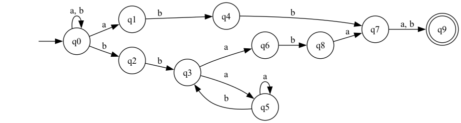
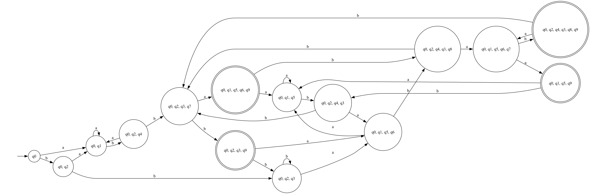
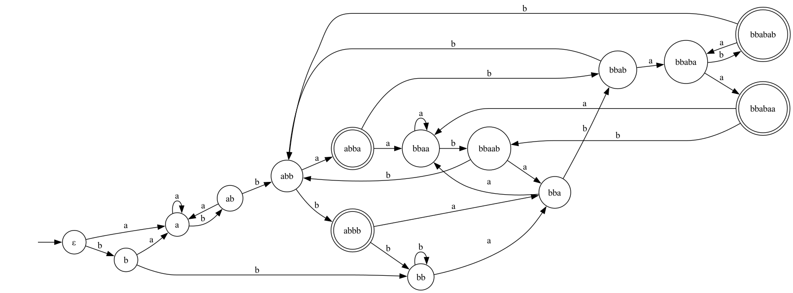
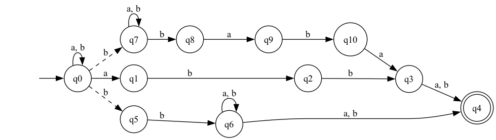

Дано регулярное выражение

$$((a | b)^\star abb(a | b)) | (a|ba)^\star bb(a^\star b)^\star aba(a | b)$$

Построим его минимальный НКА:

Его таблица суффиксов и префиксов:
|          | **a** | **ε** | **aa** | **ba** | **abab** | **baa** | **ababaa** | **babaa** | **bba** | **abba** |
| -------- | ----- | ----- | ------ | ------ | -------- | ------- | ---------- | --------- | ------- | -------- |
| **abb**  | 1     | 0     | 0      | 0      | 1        | 0       | 1          | 1         | 0       | 1        |
| **abba** | 0     | 1     | 0      | 0      | 0        | 1       | 1          | 1         | 1       | 1        |
| **bbab** | 0     | 0     | 1      | 1      | 1        | 0       | 1          | 1         | 1       | 1        |
| **ab**   | 0     | 0     | 0      | 1      | 0        | 0       | 0          | 1         | 0       | 1        |
| **bb**   | 0     | 0     | 0      | 0      | 1        | 0       | 1          | 1         | 0       | 1        |
| **bba**  | 0     | 0     | 0      | 0      | 0        | 1       | 1          | 1         | 1       | 1        |
| **bbaa** | 0     | 0     | 0      | 0      | 0        | 0       | 1          | 1         | 1       | 1        |
| **b**    | 0     | 0     | 0      | 0      | 0        | 0       | 0          | 1         | 0       | 1        |
| **a**    | 0     | 0     | 0      | 0      | 0        | 0       | 0          | 0         | 1       | 1        |
| **ε**    | 0     | 0     | 0      | 0      | 0        | 0       | 0          | 0         | 0       | 1        |

По данному НКА построим ДКА:

Отметим классы эквивалентности:

Теперь проверим его минимальность с помощью таблицы классов эквивалентности:

|            | **ε** | **abba** | **bba** | **babaa** | **a** | **aa** | **abaa** | **ba** | **baa** |
| ---------- | ----- | -------- | ------- | --------- | ----- | ------ | -------- | ------ | ------- |
| **ε**      | 0     | 1        | 0       | 0         | 0     | 0      | 0        | 0      | 0       |
| **a**      | 0     | 1        | 1       | 0         | 0     | 0      | 0        | 0      | 0       |
| **b**      | 0     | 1        | 0       | 1         | 0     | 0      | 0        | 0      | 0       |
| **ab**     | 0     | 0        | 0       | 1         | 0     | 0      | 0        | 1      | 0       |
| **abb**    | 0     | 1        | 0       | 1         | 1     | 0      | 1        | 0      | 0       |
| **abbb**   | 1     | 1        | 0       | 1         | 0     | 0      | 1        | 0      | 0       |
| **abba**   | 1     | 0        | 1       | 1         | 0     | 0      | 0        | 0      | 1       |
| **bb**     | 0     | 1        | 0       | 1         | 0     | 0      | 1        | 0      | 0       |
| **bba**    | 0     | 1        | 1       | 1         | 0     | 0      | 0        | 0      | 0       |
| **bbaa**   | 0     | 1        | 1       | 1         | 0     | 0      | 0        | 0      | 1       |
| **bbaab**  | 0     | 1        | 0       | 1         | 0     | 0      | 1        | 1      | 0       |
| **bbab**   | 0     | 1        | 0       | 1         | 0     | 1      | 1        | 1      | 0       |
| **bbaba**  | 0     | 1        | 1       | 1         | 1     | 0      | 0        | 0      | 1       |
| **bbabaa** | 1     | 1        | 1       | 1         | 0     | 0      | 0        | 0      | 0       |
| **bbabab** | 1     | 1        | 0       | 1         | 0     | 1      | 1        | 1      | 1       |

Все строки различны, следовательно, состояния различимы. Значит, это минимальный ДКА.

Построим ПКА. Но для начала перепишем регулярное выражение в расширенном виде:
$$\hat{\ } ((a|b)^\star (?<=abb)(a|b))|(a|b)^\star (?=bb)(a|b)^\star (?<=baba)(a|b)\$ $$

Как было построено данное выражение. Для первой ветки $(a | b)^\star abb(a | b)$ видно, что строка может начинаться на что угодно, но должна заканчиваться или на $abba$, или $abbb$. Здесь очевидно. Во второй ветке $(a|ba)^\star bb(a^\star b)^\star aba(a | b)$ условие $bb(a^\star b)^\star aba$ можно интерпретировать так: слово начинается на $bb$ и заканчивается на $baba$. Здесь два варианта: $bbaba$ и $bb.^\star baba$ (так как если применяется $(a^\star b)^\star$, то она обязана заканчиваться на $b$). Почему мы во второй ветке можем заменить $(a|ba)^\star$ на $(a|b)^\star$? Это следует из того, что изначальная конструкция не допускает последовательности $bb$. Но если мы в нашем слове встречаем $bb$, то (так как нам не важно что стоит внутри $bb.^\star baba$) всё что стоит между $bb$ и $baba$ сворачивается в $.^\star$.

Теперь с учетом этих выражений построим наш ПКА:

Таблица префиксов и суффиксов для НКА:

|          | **a** | **ε** | **baa** | **bba** | **ababaa** | **babaa** |
| -------- | ----- | ----- | ------- | ------- | ---------- | --------- |
| **abba** | 0     | 1     | 1       | 1       | 1          | 1         |
| **bba**  | 0     | 0     | 1       | 1       | 1          | 1         |
| **bbab** | 0     | 0     | 0       | 1       | 1          | 1         |
| **bb**   | 0     | 0     | 0       | 0       | 1          | 1         |
| **ab**   | 0     | 0     | 0       | 0       | 0          | 1         |
| **a**    | 0     | 0     | 0       | 1       | 0          | 0         |

