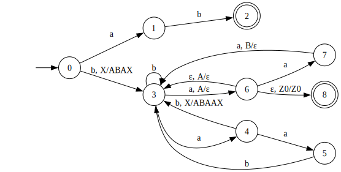
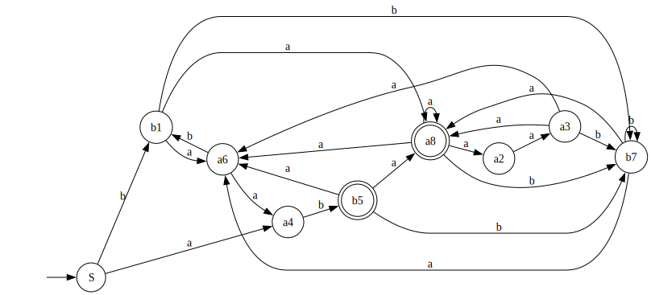
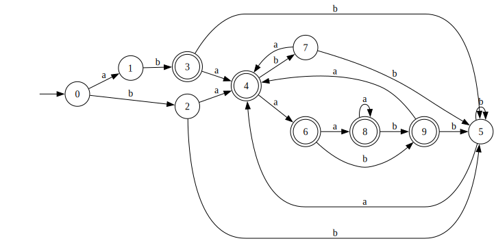
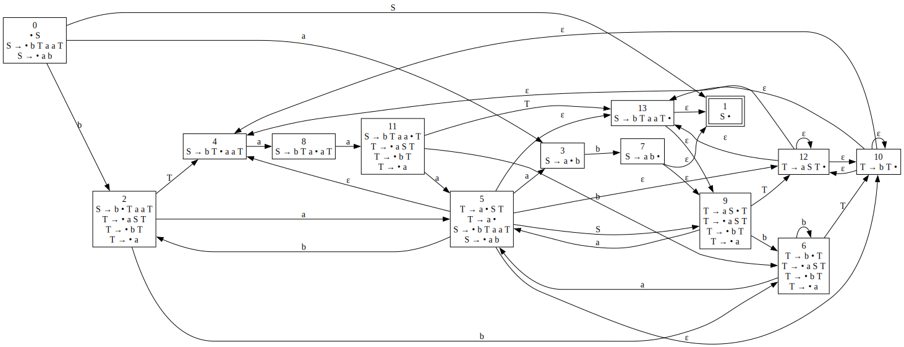
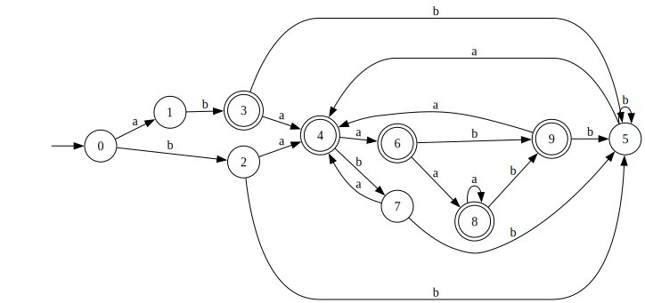

## PDA
Дана КС-грамматика:

$$
S → bTaaT
$$
$$
T → aST
$$
$$ 
T → bT
$$ 
$$
S → ab
$$
$$
T → a
$$

Докажем, что дан недетерминированный язык. Пересечем данный язык $L$ с регулярным языком $(baaaa)^+ baaa (ba)^+ ba^+$
Тогда следующим образом получим слово
$$S → bTaaT → bTaaabTaaTT → bTaaabTaaabTaaTTT → ... → (ba^4)^n baaaT^{n+1}$$
$T^{n+1}$ можно расскрыть так:

1. $T → ba$
    $T^{n+1} → (ba)^n ba$
2. $T → baST → babTaaTT → bababTaaTTaaTT → (ba)^n a^{4n+1}$
Остальные $T → a$

Тогда получаем, что для префикса:
$$(ba^4)^n baaa(ba)^n b$$
Существуют суффиксы:

1. $$a$$
2. $$a^{5n+1}$$

Рассмотрим первую часть леммы Ю, когда накачка производится в суффиксе. Очевидно, мы не можем накачивать никакую подстроку из $baaa$ и $b$, так как выйдем из языка. $baaa$ можно накачивать на стыке с $(ba^4)^n baaa$, но это просто приводит к накачке $(ba^4)^n$. Следовательно для префикса получаем:

$$
(ba^4)^{n+i} baaa(ba)^{n+i}b 
$$ 

Но в таком случае можно провести отрицательную накачку и получить $baaab$, что значит мы вышли из языка.

Перейдем ко второй части леммы. 
1. Попробуем накачать $ba^4$ и $a$: 

$$
(ba^4)^{n+j(k-1)} baaa(ba)^nba^i
$$ 

Это слово принадлежит языку, если $k(j-1) + 1 = i$, и следовательно, $k=1$, так как $(ba^4)^{n+k(j-1)} baaaT^{n+1+k(j-1)} → (ba^4)^{n+k(j-1)} baaaT^nT^{k(j-1)+1} → (ba^4)^{n+j} baaaT^nbaT^{k(j-1)}$. Следовательно, мы накачиваем в префиксе $ba^4$  Во втором суффиксе мы должны взять подслово $a^l$. Тогда получим:

$$
(ba^4)^{n-1+i} baaa(ba)^nba^{5n+1+l(i-1)}
$$ 

Рассмотрим отрицательную накачку $(ba^4)^{n-1} baaa(ba)^nba^{5n+1-l}$. Тогда $(ba^4)^{n-1} baaaT^{n}$. Противоречие.

2. Попробуем накачать $ba$ и $a$: 

$$
(ba^4)^{n} baaa(ba)^{n+k(j-1)}ba^i
$$

Тогда $T^{n+1} → (ba)^{n+k(j-1)}ba^i$ или $T → (ba)^{k(j-1)}ba^i$, но здесь получаем равенство $i = 4(k(j-1)) + 1$. Тогда $4k=1$. Противоречие.

Было доказано, что язык недетерминирован.

Построим NPDA:

При переходе $b → a → b$, на $b$ происходит PUSH. При переходе $b → a → a$, на $a$ получаем POP.

## Беспрефиксность
Язык не является беспрефиксным. Например, $w_1 = bTaaT = baaaT = baaaa$, но последнюю T можно раскрыть иначе: $w_2 = bTaaT = baaaT = baaaaST = ba^4aba$. Значит, $w_1$ префикс $w_2$. Любое слово, кроме $ab$, заканчивается на $a$. К этим словам всегда можно приписать $ST$.

## НФХ
Построим НФХ для нашей грамматики:

$$
S → AB
$$
$$
S → BT_1
$$
$$
T_1 → TA_1
$$
$$
A_1 → AA_2
$$
$$
A_2 → AT
$$
$$
T → AS_1
$$
$$
S_1 → ST
$$
$$
T → BT | a
$$
$$
A → a
$$
$$
B → b
$$

## LL(1)-автомат
Построим аппроксимациями сверху LL(1). Пронумеруем все терминалы в грамматике

$$
S → b_1Ta_2a_3T
$$
$$
S → a_4b_5
$$
$$
T → a_6ST
$$
$$ 
T → b_7T
$$ 
$$
T → a_8
$$

$$
First(L) = b_1, a_4
$$
$$ 
Last(L) = b_5, a_8
$$
$$
Follow(L) = b_1a_6, b_1b_7, b_1a_8,
            a_2a_3,
            a_3a_6, a_3b_7, a_3a_8,
            a_4b_5,
            b_5a_6, b_5b_7, b_5a_8,
            a_6b_1, a_6b_4,
            b_7a_6, b_7b_7, b_7a_8,
            a_8a_6, a_8b_7, a_8a_8, a_8a_2
$$

Детерминизируем его:
LL(1)-автомат

Пересечем его с КС-грамматикой: [LL(1)](grammar/intersection_grammar_LL1.txt)

## LR(0)-автомат
Построим позиционный автомат:

Детерминизируем его:
LR(0)-автомат

Пересечем его с КС-грамматикой: [LR(0)](grammar/intersection_grammar_LR0.txt)